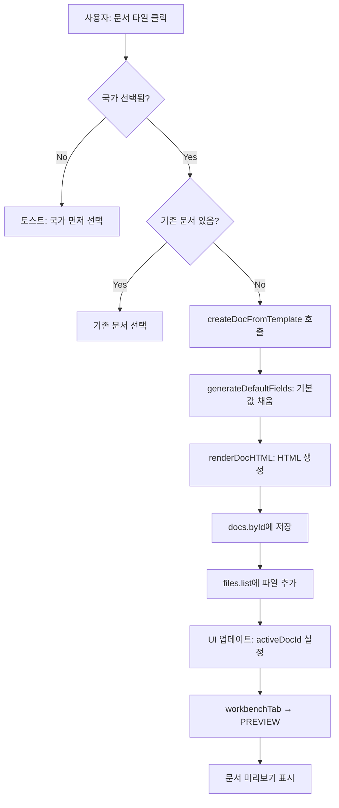
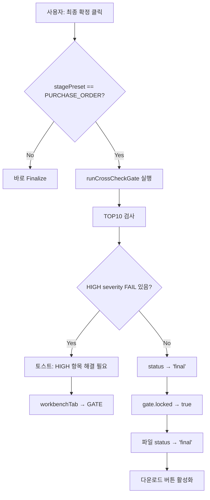

# K-Beauty AI 무역비서 - 코드베이스 완전 요약 문서

> **Gemini AI 리뷰용 문서** | 생성일: 2026-02-06  
> 이 문서는 전체 코드베이스의 구조, 기능, 상태 관리, 컴포넌트, Edge Functions를 상세히 정리한 것입니다.

---

## 📌 1. 프로젝트 개요

### 1.1 서비스 비전
**"60초 안에, 바이어에게 보낼 서류가 자동으로 준비된다"**

K-뷰티 화장품 수출 담당자가 대화만으로 전문적인 수출 패키지 및 거래 서류를 완성하는 AI 무역비서 SaaS.

### 1.2 핵심 원칙
- **빈 템플릿 금지**: 항상 기본값이 채워진 완성형 초안 제공
- **Genspark 스타일 UI**: 중앙 에이전트 채팅 + 우측 Workbench 패널
- **Cross-check Gate**: 본오더 단계에서 문서 간 불일치 자동 검사 및 잠금

### 1.3 기술 스택
| 분류 | 기술 |
|------|------|
| Frontend | React 18 + TypeScript + Vite |
| Styling | Tailwind CSS + shadcn/ui |
| State | Zustand (persist middleware) |
| Backend | Supabase (Lovable Cloud) |
| AI | Lovable AI Gateway (Gemini 3 Flash) |
| Routing | React Router v6 |
| Build | Vite + Bun |

---

## 📁 2. 프로젝트 구조

```
src/
├── components/           # UI 컴포넌트
│   ├── agent/           # AI 에이전트 채팅 (AgentChatPanel)
│   ├── auth/            # 인증 (AuthModal, ProtectedRoute)
│   ├── context/         # 컨텍스트 칩 바 (국가/채널 표시)
│   ├── debug/           # 디버그 패널 (admin 전용)
│   ├── layout/          # 레이아웃 (GensparkLayout, LeftDock)
│   ├── workbench/       # 워크벤치 패널 (Preview/Files/Gate)
│   ├── workspace/       # 문서 탭별 컴포넌트
│   ├── crm/             # 바이어 CRM 관련
│   ├── crosscheck/      # Cross-check Gate 엔진
│   ├── email/           # 이메일 생성기
│   ├── export/          # PDF/ZIP 내보내기
│   └── ui/              # shadcn/ui 공통 컴포넌트
│
├── stores/              # 상태 관리
│   └── appStore.ts      # 중앙 집중식 Zustand 스토어 (★핵심)
│
├── lib/                 # 유틸리티/비즈니스 로직
│   ├── api/             # API 호출 (emailGenerator, tradeAssistant)
│   ├── chat/            # 문서 편집 파서
│   ├── crosscheck/      # Gate 엔진 로직
│   ├── export/          # PDF/ZIP 생성
│   ├── i18n/            # 다국어 지원
│   └── templates/       # 문서 템플릿 엔진
│
├── hooks/               # 커스텀 훅
│   ├── useAuth.ts       # 인증 상태
│   ├── useBuyers.ts     # 바이어 CRUD
│   ├── useCompany.ts    # 회사 정보
│   └── useAppState.ts   # 앱 상태 래퍼
│
├── pages/               # 라우트별 페이지
│   ├── Index.tsx        # 메인 진입점
│   ├── HomePage.tsx     # 에이전트 홈
│   ├── LandingPage.tsx  # 랜딩 페이지
│   ├── CRMPage.tsx      # 바이어 CRM
│   ├── CompliancePage.tsx # 컴플라이언스
│   └── SettingsPage.tsx # 설정
│
├── types/               # TypeScript 타입 정의
│   └── index.ts         # 공통 타입
│
└── integrations/        # 외부 연동
    └── supabase/        # Supabase 클라이언트 + 타입

supabase/
└── functions/           # Edge Functions
    ├── trade-assistant/ # AI 채팅 엔진
    ├── ocr-extract/     # OCR 성분 추출
    ├── generate-email/  # 이메일 생성
    └── share-package/   # 패키지 공유 링크
```

---

## 🗄️ 3. 중앙 상태 관리 (appStore.ts)

### 3.1 상태 구조 (AppState)

```typescript
interface AppState {
  // 세션 정보
  session: {
    userId: string | null;
    email: string | null;
    role: 'user' | 'admin';
  };
  
  // 워크스페이스
  workspace: {
    workspaceId: string | null;
    name: string;
  };
  
  // 프로젝트 설정 (★핵심)
  project: {
    projectId: string | null;
    name: string;
    targetCountries: TargetCountry[];  // ['US', 'JP', 'EU', ...]
    channel: SalesChannel;              // '도매' | '리테일' | 'D2C' | ...
    stagePreset: StagePreset;           // 'FIRST_PROPOSAL' | 'SAMPLE' | 'PURCHASE_ORDER'
    buyerType: BuyerType;
    language: Language;                 // 'KO' | 'EN' | 'JP'
    currency: Currency;                 // 'USD' | 'JPY' | ...
    incotermsDefault: Incoterms;        // 'FOB' | 'CIF' | 'DDP' | 'EXW'
    paymentDefault: PaymentTerms;
  };
  
  // 회사 프로필
  companyProfile: {
    companyName: string;
    address: string;
    phone: string;
    website: string;
    logoUrl: string;
    brandTone: 'clean' | 'luxury' | 'natural';
    brandColors: { primary: string; secondary: string; accent: string };
  };
  
  // 제품 프로필
  productProfile: {
    productName: string;
    category: string;
    skuList: SKUItem[];           // [{sku, name, size, unitPrice, moq, leadTimeDays}]
    inciIngredients: INCIIngredient[];
    labelImagesFileIds: string[];
  };
  
  // UI 상태
  ui: {
    activePage: ActivePage;       // 현재 페이지
    activeDocId: string | null;   // 선택된 문서 ID
    selectedFileId: string | null;
    workbenchTab: WorkbenchTab;   // 'PREVIEW' | 'FILES' | 'GATE' | ...
    showTour: boolean;
    showDebugPanel: boolean;
  };
  
  // 문서 저장소
  docs: {
    byId: Record<string, DocInstance>;
  };
  
  // 파일 목록
  files: {
    list: FileItem[];
  };
  
  // 컴플라이언스 정보
  compliance: {
    byCountry: Record<string, CountryCompliance>;
  };
  
  // 디버그 로그
  debug: {
    lastActions: DebugAction[];  // 최근 20개 액션 기록
  };
}
```

### 3.2 핵심 액션 함수

| 함수명 | 설명 |
|--------|------|
| `handleAction({type, payload})` | 중앙 액션 디스패처 (모든 UI 인터랙션 라우팅) |
| `navigate(page)` | 페이지 네비게이션 |
| `setPreset(preset)` | 거래 단계 변경 (FIRST_PROPOSAL/SAMPLE/PURCHASE_ORDER) |
| `createDocFromTemplate({templateKey, preset})` | 문서 생성 (빈 템플릿 금지, 기본값 채움) |
| `renderDocHTML({templateKey, fields})` | 필드 기반 HTML 렌더링 |
| `applyFieldPatch({docId, patch})` | 필드 패치 적용 (MOQ, 단가 등 업데이트) |
| `runCrossCheckGate(docId)` | Cross-check Gate TOP10 검사 실행 |
| `finalizeDoc(docId)` | 문서 최종 확정 (Gate 통과 필수) |
| `runCompliance({countries})` | 국가별 컴플라이언스 검사 |
| `exportZip()` | 최종 확정된 문서 ZIP 내보내기 |

### 3.3 문서 인스턴스 구조

```typescript
interface DocInstance {
  docId: string;
  title: string;
  stagePreset: StagePreset;
  templateKey: string;
  status: 'draft' | 'final';
  fields: Record<string, any>;    // 문서 데이터 필드
  html: string;                    // 렌더링된 HTML
  qa: { score: number; warnings: QAWarning[] };  // QA 점수
  gate: {
    required: number;
    passed: number;
    locked: boolean;
    results: GateResult[];         // Gate 검사 결과
  };
  createdAt: Date;
  updatedAt: Date;
}
```

---

## 📄 4. 문서 템플릿 시스템

### 4.1 프리셋별 문서 타일

#### FIRST_PROPOSAL (첫 제안)
| 순서 | 템플릿 키 | 문서명 | 설명 |
|------|----------|--------|------|
| 1 | DECK_COMPANY_BRAND_15P | 브랜드 소개서 | ≤15p 회사/브랜드 소개 |
| 2 | CATALOG_15P | 제품 카탈로그 | ≤15p 제품 라인업 |
| 3 | COMPLIANCE_SNAPSHOT_15P | 수출 준비 요약 | 국가별 규제 요약 |
| 4 | EMAIL_FIRST_OUTREACH | 첫 제안 이메일 | 바이어 접촉 메일 |
| 5 | EMAIL_FOLLOW_UP | 후속 이메일 | 리마인더 메일 |

#### SAMPLE (샘플)
| 순서 | 템플릿 키 | 문서명 | 설명 |
|------|----------|--------|------|
| 1 | PI_SAMPLE | 샘플 PI | 샘플용 견적서 |
| 2 | PL_SAMPLE | 샘플 포장명세서 | 포장 상세 내역 |
| 3 | EMAIL_SAMPLE | 샘플 이메일 | 발송/확인 메일 |
| 4 | MEMO_LABEL_CHECK | 라벨 체크 메모 | 라벨/아트웍 확인 |

#### PURCHASE_ORDER (본오더)
| 순서 | 템플릿 키 | 문서명 | 설명 |
|------|----------|--------|------|
| 1 | PI_FINAL | 최종 PI | 정식 견적서 |
| 2 | CONTRACT_SALES | 판매 계약서 | 거래 계약서 |
| 3 | INVOICE_COMMERCIAL | 상업 송장 | 인보이스 |
| 4 | PL_FINAL | 포장명세서 | 최종 포장 내역 |
| 5 | SHIPPING_INSTRUCTION | 선적 지시서 | 포워더용 정보 |
| 6 | GATE_CROSSCHECK_PO | 실수 체크 게이트 | 문서 간 검증 |

### 4.2 필드 기본값 생성 로직

모든 문서는 `generateDefaultFields()` 함수를 통해 **빈 템플릿 없이** 기본값이 채워집니다:

```typescript
// PI 문서 예시
{
  piNumber: `PI-${timestamp}`,
  validityDays: 30,
  items: productProfile.skuList.map(s => ({
    sku: s.sku,
    name: s.name,
    qty: s.moq,              // 회사 기본 MOQ 적용
    unitPrice: s.unitPrice,  // 회사 기본 단가 적용
    amount: s.moq * s.unitPrice,
  })),
  incoterms: project.incotermsDefault,  // 프로젝트 기본 인코텀즈
  paymentTerms: project.paymentDefault,
  leadTime: productProfile.skuList[0].leadTimeDays,
  // ...
}
```

---

## 🔍 5. Cross-check Gate 시스템

### 5.1 Gate TOP10 검사 항목

본오더(PURCHASE_ORDER) 단계에서 **Finalize 전 필수 통과**해야 하는 10가지 검사:

| ID | 심각도 | 검사 항목 | 규칙 |
|----|--------|----------|------|
| G1 | HIGH | 당사자/주소/연락처 불일치 | PI/계약서/인보이스 간 당사자 정보 일치 |
| G2 | HIGH | 인코텀즈+Port/Place 불일치 | 모든 문서에서 Incoterms/Port 일치 |
| G3 | HIGH | 결제조건/은행정보/만기 불일치 | 결제 조건 통일 |
| G4 | HIGH | SKU/수량/단가/총액 재계산 불일치 | 수량×단가=금액 검증 |
| G5 | HIGH | HS CODE/Origin/Description 누락 | 필수 무역 정보 존재 |
| G6 | HIGH | Compliance NEED_ACTION 존재 | 규제 미충족 시 잠금 |
| G7 | MED | 샘플→본오더 변경조건 미반영 | 조건 변경 추적 |
| G8 | MED | 포장/중량/CBM 불일치 | PL vs 인보이스 검증 |
| G9 | MED | 필수 첨부 서류 체크 미완료 | 국가/채널별 필수 서류 |
| G10 | MED | 계약서 최소 안전조항 누락 | 클레임/관할/분쟁 조항 |

### 5.2 Gate 로직 구현

```typescript
function runGateChecks(docs: DocInstance[], state: AppState): GateResult[] {
  const piDoc = docs.find(d => d.templateKey === 'PI_FINAL');
  const contractDoc = docs.find(d => d.templateKey === 'CONTRACT_SALES');
  const invoiceDoc = docs.find(d => d.templateKey === 'INVOICE_COMMERCIAL');
  
  return [
    {
      id: 'G1',
      title: '당사자/주소/연락처 불일치',
      severity: 'HIGH',
      rule: 'PI/계약서/인보이스 간 당사자 정보가 일치해야 함',
      status: piDoc && contractDoc && 
              piDoc.fields.companyName === contractDoc.fields.seller 
              ? 'PASS' : 'FAIL',
    },
    // ... G2~G10
  ];
}
```

### 5.3 Finalize 잠금 로직

```typescript
finalizeDoc: (docId) => {
  if (doc.stagePreset === 'PURCHASE_ORDER') {
    const results = runCrossCheckGate(docId);
    const hasHighFail = results.some(r => r.severity === 'HIGH' && r.status === 'FAIL');
    if (hasHighFail) return false;  // HIGH FAIL 있으면 Finalize 불가
  }
  
  set({ docs: { byId: { [docId]: { status: 'final', gate: { locked: true } } } } });
  return true;
}
```

---

## 🌍 6. 컴플라이언스 시스템

### 6.1 지원 국가

| 코드 | 국가명 | 주요 규제 기관 |
|------|--------|---------------|
| US | 미국 | FDA (MoCRA 2022) |
| JP | 일본 | 후생노동성 |
| EU | 유럽연합 | CPNP/CPSR |
| HK | 홍콩 | - (라벨링만) |
| TW | 대만 | TFDA |
| CN | 중국 | NMPA |
| VN | 베트남 | 공증 서류 필요 |
| ID | 인도네시아 | BPOM |
| MY | 말레이시아 | NPRA |
| TH | 태국 | FDA Thailand |
| AU | 호주 | AICIS |

### 6.2 국가별 RulePack 구조

```typescript
interface RulePackItem {
  ruleId: string;      // 'R1', 'R2', ...
  title: string;       // '규제 항목명'
  evidence: string;    // '근거 법령'
  checkHow: string;    // '확인 방법'
  action: string;      // '조치 방법'
  status: 'OK' | 'NEED_CHECK' | 'NEED_ACTION';
}
```

### 6.3 미국(US) RulePack 예시

```typescript
[
  { ruleId: 'R1', title: 'INCI 영문 표기', evidence: '21 CFR 701.3', ... },
  { ruleId: 'R2', title: '원산지 표기', evidence: 'FTC 규정', ... },
  { ruleId: 'R3', title: 'FDA MoCRA 등록', evidence: 'MoCRA 2022', status: 'NEED_CHECK' },
  { ruleId: 'R4', title: 'Drug vs Cosmetic 분류', evidence: '21 CFR 201', ... },
  { ruleId: 'R5', title: '경고문구', evidence: '21 CFR 740', ... },
]
```

### 6.4 라벨 요구사항

```typescript
interface LabelRequirement {
  item: string;        // '제품명', '전성분(INCI)', ...
  requirement: string; // '현지어 표기', 'ml/g 단위 표기', ...
  status: 'OK' | 'NEED_CHECK' | 'NEED_ACTION';
  note: string;
}
```

---

## 🤖 7. AI 에이전트 시스템

### 7.1 의도 분류 (Intent Detection)

```typescript
function detectIntent(message: string): { intent: string; entities: Record<string, any> } {
  const lowerMsg = message.toLowerCase();
  
  // MOQ 변경 감지
  if (lowerMsg.includes('moq') || lowerMsg.includes('최소주문')) {
    const match = message.match(/(\d+)/);
    if (match) return { intent: 'update_fields', entities: { field: 'moq', value: parseInt(match[1]) } };
  }
  
  // 단가 변경
  if (lowerMsg.includes('단가') || lowerMsg.includes('가격')) { ... }
  
  // 인코텀즈 변경
  const incotermsMatch = message.match(/(FOB|CIF|DDP|EXW)/i);
  if (incotermsMatch) { ... }
  
  // 문서 생성
  if (lowerMsg.includes('pi 만들') || lowerMsg.includes('견적서')) {
    return { intent: 'create_doc', entities: { templateKey: 'PI_FINAL' } };
  }
  
  return { intent: 'help', entities: {} };
}
```

### 7.2 지원 인텐트 목록

| Intent | 설명 | 예시 입력 |
|--------|------|----------|
| `update_fields` | 필드 업데이트 | "MOQ를 1000으로 바꿔줘" |
| `create_doc` | 문서 생성 | "PI 만들어줘" |
| `run_compliance` | 규제 검사 | "미국 규제 확인해줘" |
| `run_gate` | Gate 검사 | "문서 점검해줘" |
| `finalize` | 최종 확정 | "확정해줘" |
| `export` | 내보내기 | "다운로드" |
| `help` | 도움말 | "뭐할 수 있어?" |

### 7.3 필드 패치 적용

```typescript
// "MOQ를 1000으로 바꿔줘" 처리
applyFieldPatch({
  docId: activeDoc.docId,
  patch: {
    moq: 1000,
    items: activeDoc.fields.items.map(item => ({
      ...item,
      qty: 1000,
      amount: 1000 * item.unitPrice,
    })),
    totalAmount: /* 재계산 */,
  }
});
// → HTML 자동 재렌더링
```

---

## 🔧 8. Edge Functions (Supabase)

### 8.1 trade-assistant (AI 채팅)

**경로**: `supabase/functions/trade-assistant/index.ts`

**기능**: Lovable AI Gateway를 통해 Gemini 3 Flash 모델로 무역 상담 응답 생성

**시스템 프롬프트 주요 내용**:
- 화장품 수출 서류 작성 지원
- 국가별 규제 안내 (FDA, EU CPNR, NMPA, 후생노동성)
- 성분 분석 및 규제 적합성 확인
- 바이어 커뮤니케이션 문구 작성

```typescript
serve(async (req) => {
  const { messages, context } = await req.json();
  
  // 컨텍스트 빌드 (제품/거래/국가 정보)
  let contextPrompt = SYSTEM_PROMPT;
  if (context?.products) { ... }
  if (context?.deal) { ... }
  if (context?.targetCountry) { ... }
  
  // Lovable AI Gateway 호출
  const response = await fetch("https://ai.gateway.lovable.dev/v1/chat/completions", {
    body: JSON.stringify({
      model: "gemini-2.5-pro",
      messages: [{ role: "system", content: contextPrompt }, ...messages],
      stream: true,
    }),
  });
  
  return new Response(response.body, { headers: { "Content-Type": "text/event-stream" } });
});
```

### 8.2 ocr-extract (성분 OCR)

라벨 이미지에서 INCI 성분 추출

### 8.3 generate-email (이메일 생성)

바이어 대상 이메일 템플릿 자동 생성

### 8.4 share-package (패키지 공유)

바이어 패키지 공유 링크 생성

---

## 🎨 9. UI 컴포넌트 구조

### 9.1 GensparkLayout (메인 레이아웃)

```
┌──────────────────────────────────────────────────────────┐
│ Header: 브랜드 + 컨텍스트 칩 바 (국가/채널 표시)          │
├────────────────────────┬─────────────────────────────────┤
│                        │                                 │
│    AgentChatPanel      │      WorkbenchPanel             │
│    (에이전트 채팅)      │      (탭: Preview/Files/Gate)   │
│                        │                                 │
│  ┌──────────────────┐  │  ┌───────────────────────────┐  │
│  │ 프리셋 선택       │  │  │ Tab: Preview             │  │
│  │ (첫제안/샘플/본오더)│  │  │ - 문서 HTML 미리보기     │  │
│  ├──────────────────┤  │  │ - 스크롤 가능              │  │
│  │                  │  │  ├───────────────────────────┤  │
│  │ 채팅 메시지 영역  │  │  │ Tab: Files               │  │
│  │                  │  │  │ - 문서 타일 목록          │  │
│  │                  │  │  │ - 생성/초안/최종 상태     │  │
│  ├──────────────────┤  │  ├───────────────────────────┤  │
│  │ 빠른 실행 버튼    │  │  │ Tab: Gate (본오더만)     │  │
│  │ (문서생성/검사등)  │  │  │ - TOP10 검사 결과        │  │
│  ├──────────────────┤  │  │ - 진행률 바               │  │
│  │ 채팅 입력창       │  │  │ - 최종확정 버튼          │  │
│  └──────────────────┘  │  └───────────────────────────┘  │
│                        │                                 │
└────────────────────────┴─────────────────────────────────┘
```

### 9.2 WorkbenchPanel 탭 구조

| 탭 | 컴포넌트 | 설명 |
|----|----------|------|
| PREVIEW | DocPreview | 문서 HTML 미리보기 (스크롤 가능) |
| FILES | DocTileList | 프리셋별 문서 타일 목록 |
| FIELDS | FieldEditor | JSON 필드 편집 (채팅으로 수정) |
| GATE | GatePanel | Cross-check TOP10 검사 (본오더만) |
| CHECKLIST | ChecklistView | 문서 생성 체크리스트 |
| HISTORY | HistoryLog | 파일 생성 히스토리 |

### 9.3 ContextChipsBar

헤더에 현재 프로젝트 컨텍스트 표시:
- 타겟 국가 (예: 🇺🇸 미국, 🇯🇵 일본)
- 판매 채널 (예: 도매, 리테일)
- 거래 단계 (첫 제안/샘플/본오더)

---

## 🗃️ 10. 데이터베이스 스키마 (Supabase)

### 10.1 주요 테이블

| 테이블 | 설명 | 주요 컬럼 |
|--------|------|----------|
| `companies` | 회사 정보 | name, address, logo_url, default_moq, default_incoterms |
| `products` | 제품 정보 | name, category, sku_code, unit_price_range |
| `buyers` | 바이어 정보 | name, country, channel, status_stage |
| `deals` | 거래 정보 | buyer_id, product_id, quantity, unit_price, trade_stage_enum |
| `documents` | 문서 저장 | type, title, content, status, version |
| `compliance_runs` | 컴플라이언스 검사 결과 | target_countries, findings, traffic_light |
| `agent_memory` | AI 학습 데이터 | memory_type, key, value, confidence |
| `workspaces` | 워크스페이스 | workspace_name, owner_user_id |

### 10.2 Enum 타입

```sql
-- 거래 단계
CREATE TYPE trade_stage AS ENUM ('first_proposal', 'sample', 'main_order', 'reorder');

-- 판매 채널
CREATE TYPE sales_channel AS ENUM ('wholesale', 'offline_retail', 'online_marketplace', 'd2c');

-- 바이어 유형
CREATE TYPE buyer_type AS ENUM ('importer', 'distributor', 'retailer', 'market_seller');

-- 문서 상태
CREATE TYPE doc_status AS ENUM ('draft', 'edited', 'final', 'sent');
```

---

## ⚡ 11. 핵심 워크플로우

### 11.1 문서 생성 플로우



### 11.2 필드 수정 플로우

```mermaid
graph TD
    A[사용자: 채팅 입력 'MOQ를 1000으로'] --> B[detectIntent 분석]
    B --> C{intent: update_fields}
    C --> D[entities: {field: 'moq', value: 1000}]
    D --> E[applyFieldPatch 호출]
    E --> F[fields 딥 머지]
    F --> G[items 배열 qty/amount 재계산]
    G --> H[totalAmount 재계산]
    H --> I[renderDocHTML 재실행]
    I --> J[docs.byId 업데이트]
    J --> K[Preview 즉시 갱신]
```

### 11.3 본오더 Finalize 플로우



---

## 🐛 12. 디버그 시스템

### 12.1 Debug Panel (Admin 전용)

- `appState.session.role === 'admin'` 시에만 표시
- 토글 버튼으로 on/off
- 표시 내용:
  - 최근 20개 액션 로그 (`lastActions`)
  - 현재 상태 JSON

### 12.2 액션 로깅

```typescript
handleAction: (action) => {
  set((s) => ({
    debug: {
      lastActions: [
        { type: action.type, payload: action.payload, at: new Date() },
        ...s.debug.lastActions.slice(0, 19),  // 최근 20개 유지
      ],
    },
  }));
  // ... 실제 액션 처리
}
```

---

## 📊 13. Acceptance Test 체크리스트

| 테스트 | 설명 | 상태 |
|--------|------|------|
| A1 | 프리셋 클릭 → 문서 타일 즉시 변경 | ✅ |
| A2 | 문서 타일 클릭 → docs+files 생성, Preview 즉시 렌더 | ✅ |
| A3 | Preview 긴 문서 끝까지 스크롤 가능 | ✅ |
| A4 | Edit → patchObject로 표/수치 변경 반영 | ✅ |
| A5 | 본오더 Finalize: Gate 통과 전 비활성, 통과 후 LOCK | ✅ |
| A6 | 국가 선택 → 헤더/문서/컴플라이언스 정확히 바인딩 | ✅ |

---

## 🎯 14. 미구현/개선 필요 항목

### 14.1 미구현 기능
- [ ] 이메일 실제 발송 연동
- [ ] PDF 실제 생성 (html2pdf 연동)
- [ ] ZIP 다운로드 실제 구현
- [ ] OCR 성분 추출 UI 연동
- [ ] 바이어 CRM CRUD 완성
- [ ] 온보딩 투어 오버레이

### 14.2 개선 필요
- [ ] Gate 검사 로직 고도화 (실제 diff 비교)
- [ ] 컴플라이언스 RulePack 실제 데이터 연동
- [ ] AI 응답 스트리밍 UI 개선
- [ ] 다국어(EN/JP) 지원 완성

---

## 📝 15. 코드 품질 가이드라인

### 15.1 상태 관리 원칙
- 모든 UI 인터랙션은 `handleAction` 통해 라우팅
- 상태 변경은 Zustand 스토어에서만 수행
- 컴포넌트는 상태를 직접 변경하지 않음

### 15.2 타입 안전성
- 모든 상태/액션에 TypeScript 타입 정의
- `as const` 로 상수 타입 보장
- 제네릭 활용으로 재사용성 확보

### 15.3 컴포넌트 구조
- 단일 책임 원칙: 파일당 하나의 주요 기능
- 400줄 초과 시 분리 검토
- UI 로직과 비즈니스 로직 분리

---

## 📎 부록: 파일별 라인 수

| 파일 | 라인 수 | 비고 |
|------|--------|------|
| src/stores/appStore.ts | 1,509 | ★ 중앙 스토어 (리팩토링 고려) |
| src/components/workbench/WorkbenchPanel.tsx | 494 | 워크벤치 UI |
| src/components/agent/AgentChatPanel.tsx | 360 | 에이전트 채팅 |
| src/types/index.ts | 213 | 공통 타입 |
| supabase/functions/trade-assistant/index.ts | 156 | AI 채팅 Edge Function |

---

> **이 문서를 Gemini에 전달하여 코드 리뷰 및 개선 제안을 받으세요.**
> 
> 추천 질문:
> 1. "appStore.ts가 1,500줄인데 어떻게 분리하면 좋을까요?"
> 2. "Cross-check Gate 로직을 더 강건하게 만들려면?"
> 3. "컴플라이언스 RulePack을 DB 기반으로 전환하는 방법은?"
> 4. "AI 에이전트의 의도 분류 정확도를 높이려면?"
